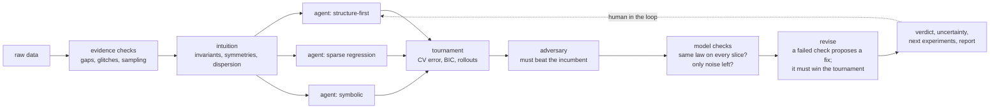

<p align="center"></p>

<p align="center"><b>An AI research lab that finds the equations behind your data, and tells you when not to trust them.</b><br>
<sub>Project: Lorenz. Python package and command line: <code>eqdisc</code>.</sub></p>

## In 30 seconds

- **You give it** measurements of something that changes: a satellite's positions, a chemical concentration on a grid, a chaotic field. Any of CSV, MAT, NPZ, HDF5 or JSON. No labels, no names, no hints.
- **You get back** the governing equation (for example `u_t = -u u_x - u_xx - u_xxxx`), a verdict on how far to trust it, error bars on every term, a forecast, and the next measurement that would settle any remaining doubt.
- **How.** Claude agents work as competing scientists who propose, test, attack and revise equations. Statistics and numerics, not the LLM, decide who wins.
- **Fastest look.** `pip install -e ".[demo]" && streamlit run demo/app.py` opens worked cases in the browser, with no API key needed.

## Why this matters

Most of science and engineering runs on differential equations: orbits, weather, combustion, epidemics, batteries, chemistry. The equation is the most useful thing you can know about a system. It forecasts beyond the data it came from, it extrapolates to conditions nobody measured, and a person can read it, check it and build on it.

For many systems nobody knows the equation. There are only measurements. Today there are three ways to get from measurements to predictions, and each has a gap:
- **Neural surrogates** (neural nets, Fourier neural operators) fit the data but are black boxes and drift once they leave it. On the LAGEOS satellite, a neural net is 3,170 km off after 30 days. The equation Lorenz found is 12 km off.
- **Equation-discovery tools** (SINDy, PySR) return readable equations, but an expert must pick the candidate terms, derivatives, noise handling and thresholds. They return a wrong equation as confidently as a right one. Plain SINDy recovers 1 of 12 blinded held-out systems.
- **Asking an LLM** mostly recites textbook equations it has memorised. That is recall, not discovery, which is why the held-out benchmark is blinded.

## Where Lorenz innovates

1. **It automates the whole scientific loop, not just the fit.** Hypothesise, experiment, select, falsify, diagnose, revise, and decide what to measure next, end to end from raw data. A single agent recovers 10 of 12 blinded systems, against 1 of 12 for SINDy.
2. **It knows when not to trust itself.** Deterministic checks ask whether the law holds on every slice of the data and whether only noise is left over. A failed check vetoes a confident verdict and proposes a fix, which must win the tournament to be kept. On corrupted data the no-LLM pipeline is never confidently wrong (0 of 96 dev cases).
3. **The LLM gives judgment; numerics give numbers.** Agents choose what to try. A toolbox does the arithmetic, and a statistical tournament (cross-validation, BIC, rollouts) picks the winner. Only refitted coefficients are scored, never constants the LLM typed.
4. **It is built against self-deception.** Blinded benchmarks rename every variable and change every coefficient by ±25%. Thresholds are tuned on development systems only. Earlier results that leaked domain information are publicly retracted ([honest_oos](docs/honest_oos.md)).

## Headline results

|  | Lorenz | baseline |
|---|---|---|
| Blinded held-out systems recovered exactly, single agent ([protocol](docs/benchmark_v1.md)) | **10 / 12** | 1 / 12 (SINDy) |
| LAGEOS-1 satellite, 30-day forecast from data alone ([details](docs/honest_oos.md)) | **12 km** | 3,170 km (neural net) |
| Blinded chaotic KS, valid forecast horizon | **4.48 Lyapunov times** | 0.78 (FNO) |
| Corrupted data sets ending confidently wrong, no-LLM pipeline, dev seeds ([details](docs/evidence.md)) | **0 / 96** | — |

The agent never sees the system's name, a description or meaningful variable names. It gets data only.

**One command: raw data in, verdict out.**
```bash
eqdisc-discover examples/data/KS_data.mat
```
```
[1/7] evidence checks on the data
[2/7] intuition pre-analysis on KS_data
      [high]   the spatial mean of u is conserved: the right-hand side is a total derivative (flux form) ...
[3/7] 3 parallel branches: ['structure-first', 'symbolic', 'sparse-regression']
[4/7] tournament
[5/7] adversary (red team) attacks the winner
[6/7] revise from the checks, then assess the final model
[7/7] write-up

CONFIDENT: We are confident this is your equation.        u_t = -1.00 u u_x - 1.00 u_xx - 1.00 u_xxxx
report: runs/discover_KS_data/report.html  (cost $1.35, 451 s)
```
<sub>Stages as in the current pipeline; verdict, cost and time from an earlier run on the same file.</sub>

---

## The research loop



- **Hypothesise.** A non-LLM pre-analysis reads the data's structure (conservation laws, symmetries, the dispersion relation, fixed points) and seeds three Claude agents. Each agent follows a different research strategy.
- **Experiment.** The agents run real numerics through a shared toolbox ([docs/toolbox.md](docs/toolbox.md)): weak-form and ensemble SINDy, PySR, skeleton fits, forward-simulation fits, coordinate transforms, symmetry search, and their own analysis code (sandboxed) and plots. The LLM never does the arithmetic.
- **Select.** A statistical tournament picks the winner, not an LLM vote.
- **Falsify.** A red-team agent attacks the winner, and a challenger is adopted only if it wins the same tournament.
- **Diagnose and revise.** Deterministic checks ask two questions: does the law hold on every slice of the data, and is only noise left over? A failed check proposes a concrete fix, such as a forcing term, a source or a missing nonlinearity. The fix is kept only if it wins.
- **Decide what to measure next.** All plausible models are simulated, and the report ranks the next experiments by how strongly they would separate those models.
- **Learn.** `eqdisc-agent --learn` writes lessons that later sessions retrieve (`memory/lessons.jsonl`), and `eqdisc-evolve` evolves the agents' playbook or discovery program AlphaEvolve-style. Held-out sets are reported, never optimised.

## Results in detail

**Blinded held-out benchmark:** 12 systems never used for tuning, 2% noise, scored on unseen initial conditions ([full table](docs/benchmark_v1.md)).

| method | exact recoveries |
|---|---|
| plain SINDy | 1 / 12 |
| auto-configured SINDy (heuristics, no LLM) | 3 / 12 |
| single Claude agent | **10 / 12** |
| full pipeline (branches, tournament, adversary) | **3 / 3** (subset) |

**Out of sample, data only** ([details and caveats](docs/honest_oos.md)):
- **LAGEOS-1, a real satellite, in random units.** The agent inferred Kepler + J₂ from the numbers alone. 30-day forecast error: 12 km. A neural net trained on the same data: 3,170 km. Kepler alone: 9,037 km.
- **Blinded Kuramoto–Sivashinsky.** Valid for 4.48 Lyapunov times; the true PDE gives 4.53 and an FNO 0.78. Weak SINDy alone matches the agent here.
- **Gray–Scott (The Well, 5% noise).** Exact structure. VRMSE over steps 6–12 is 0.068, against 0.45 for an FNO on the same data.

**Corrupted data** ([docs/evidence.md](docs/evidence.md)). 4 PDEs × 8 conditions: clean, outliers, gaps, censored tails, hidden forcing, hidden sources, run-to-run variation, extreme-value terms.
- The no-LLM pipeline is never confidently wrong: 0 of 96 dev cases, with 64 recovered exactly.
- The revise step turns hidden-forcing cases from 0/12 to 6/12 recovered, and hidden-source cases from 0/12 to 4/12.
- These are calibration seeds. Held-out seeds are next.

## See exactly what it did

Every run writes `runs/discover_<data>_<time>/`:
- **`report.html`** contains:
  - the verdict (*CONFIDENT*, *CONFIDENT IN PREDICTIONS*, *COLLECT MORE DATA*, *INCONCLUSIVE*);
  - the equation, the key steps, uncertainty for each term, data and model checks, revisions, ranked next experiments and questions for you.
- **`ledger.jsonl`** is an append-only record of every finding, data repair, tournament, revision and verdict, each tagged with dataset and config hashes.
- **`discovery.json`** and the agent transcripts hold the full research trail.

**Demo app.** Run `pip install -e ".[demo]" && streamlit run demo/app.py`. It works straight after cloning, with no API key needed for the examples.
- Worked cases: a real satellite, an honest failure the system flags itself, blind chaos (KS) and reaction–diffusion. Each shows the forecast, the verdict, the law found and where to measure next.
- *Your Data*: upload a CSV and press *Discover*.
- `EQDISC_DEMO_FAKE=1` replays a saved run at no cost.

See `demo/README.md` for more.

## Efficient by design

- **Cost.** A full run takes $1–3 and 2–8 minutes. Each agent branch costs about $0.3–0.5. For a cheap pass, use `--branches 2 --no-adversary`.
- **Cheap checks.** Every check, the grade and the verdict are deterministic numpy/scipy, with no tokens. They add about 1% to an assessment, and model checks are cached per model.
- **No wasted calls.** Identical repeated tool calls are blocked, and the critic stands aside when the tool budget is nearly spent.

## What is where

| path | what it holds |
|---|---|
| `eqdisc/orchestrate.py` | the pipeline: evidence checks → intuition → agent branches → tournament → adversary → assessment → report |
| `eqdisc/agent.py` | the Claude tool-use loop and the tool schemas the agents can call |
| `eqdisc/toolbox.py`, `weakform.py`, `fitting.py`, `symmetry.py`, `coordinates.py` | the numerics the agents run: SINDy, PySR, skeleton and trajectory fits, symmetries, transforms |
| `eqdisc/assess.py`, `uq.py`, `insights.py` | uncertainty per term, rival models, next experiments, the verdict |
| `eqdisc/ingest.py`, `report.py` | any data file in, `report.html` out |
| `eqdisc/playbook.md` | the research strategy the agents follow (method only, no domain answers) |
| `eqdisc/datagen.py`, `blind.py`, `benchmark.py` | synthetic systems, blinded variants, the benchmark |
| `demo/` | the Streamlit app (`app.py`) and the logo (`brand/`) |
| `docs/` | benchmark protocol, out-of-sample results, toolbox reference |
| `notebooks/` | five walkthroughs: baselines, structure, agent, real data, confidence |
| `.claude/skills/discover-equations` | the skill Claude Code uses when you ask it to discover equations |

## Run it

```bash
git clone https://github.com/danieldeh/autoresearch-pde && cd autoresearch-pde
python -m venv .venv && source .venv/bin/activate
pip install -e ".[notebooks]"            # add ",pysr" for symbolic regression
export ANTHROPIC_API_KEY=...             # or `ant auth login`, or a gitignored .env file
python -m eqdisc.tests.smoke             # full pipeline with Claude stubbed out: no API calls
```

```bash
eqdisc-discover examples/data/KS_data.mat                     # real Kuramoto–Sivashinsky data
eqdisc-discover my_data.csv --human --context "..."           # review the result yourself
```

**Inputs.** `.csv/.tsv/.txt`, `.mat`, `.npz/.npy`, `.h5` and `.json`, holding either time series or spatio-temporal fields. The ingester infers the layout and writes a data card listing every assumption, with how to override it.

**From Python.**
```python
from eqdisc.orchestrate import discover
res = discover("my_data.csv")
res["verdict"], res["final_model"], res["report"]
```

**From Claude Code.** Open the repo and say *"discover the equations in data/foo.csv"*. This uses the shipped `discover-equations` skill.

## Reproduce and extend

```bash
eqdisc-datagen --suite default                             # 29 ODE/PDE systems with hidden test sets
eqdisc-blind SYSTEM                                        # blinded variant: renamed variables, ±25% coefficients
python -m eqdisc.benchmark                                 # SINDy vs auto vs agent vs full pipeline
python -m eqdisc.corrupt --seeds 0 1 2                     # corrupted-data suite
python -m eqdisc.bench_evidence --arm B --split dev        # score it (no LLM)
```

Rule: tune on development systems only, and report held-out results separately.

To point it at a new problem class:
- add a tool in `eqdisc/agent.py` (implementations live in `eqdisc/toolbox.py`);
- add a research strategy in `orchestrate.STRATEGIES`;
- add method guidance in `eqdisc/playbook.md`.

Static laws y = f(x) and the notebooks are covered in [docs/sr_mode.md](docs/sr_mode.md).

### Benchmarks on open data: SRSD-Feynman hard
The harness helps on some problems. On clean simulated data, the main mistake it fixes: the model finds a formula
that fits almost perfectly, calls the small leftover error "noise", and stops.

Problems solved, out of 90 (30 problems × 3 seeds):

| | harness | bare Claude |
|---|---|---|
| Opus 5.5 | **72** | 64 |
| Sonnet 5.5 | **61** | 55 |
| Haiku 4.5 | **11** | 4 |

Ablations (Opus, same 90 problems):

| bare Claude, plus… | solved |
|---|---|
| nothing | 64 |
| the harness tools | 67 |
| one sentence: "data are noise-free; an exact formula fits to ~1e-6" | **70** |
| tools + that sentence | 69 |
| full harness | **72** |

- That one sentence does most of the work; the tools add little on top.
- On all 50 problems (one run), Opus solves 36–37 of the 37 problems the data can decide, in every setup. The
  remaining differences come from 13 problems where the data can't tell the textbook formula from a simpler one.
- Haiku fails differently: wrong formulas and running out of steps. Nothing tested fixed that.

Details, caveats and every attempt (CSV): [`docs/benchmarks/feynman_srsd_hard.md`](docs/benchmarks/feynman_srsd_hard.md).

## Benchmark runner: SRSD-Feynman, The Well, and a zero-context baseline
`run_bench.py` runs the agent on SRSD-Feynman (`eqdisc.srsd`) or The Well (`eqdisc.hf_well`: 1-D, 2-D or 3-D PDEs),
locally or on Modal. Data stream from Hugging Face inside the container, so nothing large is downloaded. Each run has
spending caps, a live dashboard and a page per attempt showing the agent's steps and reasoning.
- `--agent bare`: Claude with only the data, one Python tool and the text "Gimme PDE!" (no system prompt or eqdisc
  tools). `scripts/bare_claude.py` is a different control, with a scientist's system prompt.
- `--seed` pairs the same problems across setups. `--bare-exact` / `--harness-prompt tools|tools+exact` are the
  ablations above. `--disguise` (MHD_64) renames and rescales the data so the model can't recognise the dataset.
- Agent code runs in the bubblewrap sandbox where installed (`eqdisc.sandbox`) and always under `eqdisc.guard`, which
  blocks reading outside the agent's folder, starting processes, links and ctypes.
```bash
modal run run_bench.py --args "--benchmark srsd:hard --n 10 --total-budget 8"
modal run run_bench.py --args "--benchmark well:MHD_64 --well-params Ma_0.7_Ms_0.5. --agent bare --disguise"
python -m eqdisc.tests.test_srsd        # offline tests (also test_hf_well, test_3d, test_mhd_sim)
```
Scripts: `experiments/` (`harness_vs_bare.sh` with `MODEL=`, `experiments_mhd.sh`, `ablation_2x2.sh`).
Video: `send_video.py` sends a video's frames to Claude on Modal (`eqdisc.video`; the API takes images, not video).

## Next

- Ablations against Claude alone: Claude with a code sandbox vs Lorenz vs Lorenz with evidence checks, on held-out seeds.
- Revision families that don't assume a shape: multi-frequency forcing, spline sources.
- A partition test that decides whether a large coherent event is real dynamics or corrupt data.
- Hidden variables and delay embeddings.

## Limitations

- Every relevant state variable must be measured.
- Forcing is proposed and tested only as a sinusoid in time or a single spatial mode.
- Coordinate transforms are general for ODEs. For PDEs they are pointwise field transforms only, such as `log(u)`. PDEs are supported on 1-D and 2-D grids with one boundary type.
- Thresholds are calibrated heuristics. Treat the verdict as an evidence-backed opinion, not a proof.
- LLM priors pull toward textbook forms. The assessment checks every term against the data, and the blinded benchmark measures the residual effect.

**Related work:** LLM-SR / LLM-SRBench, KeplerAgent, STRIDE, AlphaEvolve, weak-form SINDy (Messenger & Bortz), E-SINDy.

MIT license. Example data: see `THIRD_PARTY_NOTICES.md`.
