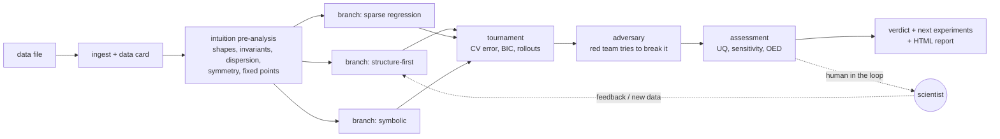

# eqdisc: autoresearch for governing equations

**Give it data. Get back the ODE/PDE, the key steps that led to it, how confident it is, and what to measure next.**

```bash
eqdisc-discover my_measurements.csv --context "what the variables are, units, anything known"
```

```
[1/6] intuition pre-analysis
      [high]   the spatial mean of u is conserved: the right-hand side is a total derivative (flux form) ...
[2/6] 3 parallel branches: ['structure-first', 'symbolic', 'sparse-regression']
[3/6] tournament
[4/6] adversary (red team) attacks the winner
[5/6] assessment of the final model
[6/6] write-up

CONFIDENT: We are confident this is your equation.        u_t = -1.00 u u_x - 1.00 u_xx - 1.00 u_xxxx
report: runs/discover_KS_data/report.html  (cost $1.35, 451 s)
```

The output is a self-contained HTML report:
- **verdict**: *CONFIDENT*, *CONFIDENT IN PREDICTIONS*, *COLLECT MORE DATA (here)* or *INCONCLUSIVE*;
- **the equation**;
- **key steps**, e.g. "the dynamics are simpler in polar coordinates" or "the spatial mean is conserved, so the
  equation is in flux form";
- **per-term uncertainty**;
- **ranked next experiments**, i.e. where plausible models disagree most relative to noise;
- **questions for you**;
- the full research trail.

---

## Install

```bash
git clone https://github.com/danieldeh/autoresearch-pde && cd autoresearch-pde
python -m venv .venv && source .venv/bin/activate
pip install -e ".[notebooks]"          # add ",pysr" for symbolic regression (installs Julia on first use)
```

**Claude API access** (the agents run on Claude). Use either of these:
- `ant auth login` with the [Anthropic CLI](https://github.com/anthropics/anthropic-cli)
  (`brew install anthropics/tap/ant`). No key to manage.
- An API key from the Claude Console: `export ANTHROPIC_API_KEY=...`, or put `ANTHROPIC_API_KEY=...` in a `.env` file
  at the repo root (it is gitignored).

Check everything works without any API calls:
```bash
python -m eqdisc.tests.smoke
```

## Quick start

```bash
eqdisc-discover examples/data/KS_data.mat                       # real Kuramoto–Sivashinsky data
eqdisc-discover examples/data/kdv_data.mat --branches 2         # real KdV data
eqdisc-discover my_data.csv --human --context "closed population; mass-action kinetics"   # you review the result
```

**Input formats**: `.csv/.tsv/.txt`, `.mat` (v5; v7.3 with `h5py`), `.npz/.npy`, `.h5`, `.json`.
- **Time series**: a time column, one column per state variable, and optionally a trajectory-id column.
- **Spatio-temporal fields**: arrays with time, space and optional trajectory axes, plus coordinate vectors.
- The ingester infers the layout and writes a **data card** of every assumption, with confidence levels and how to
  override each one (`--hint`, via `eqdisc-ingest`).

**Cost**: about $0.3–0.5 per agent branch. A default run (3 branches plus the adversary) is typically $1–3 and
2–8 minutes. Use `--branches 2 --no-adversary` for a cheaper pass, or `eqdisc-agent` for a single agent session.

### Use from Claude Code
This repo ships a Claude Code skill (`.claude/skills/discover-equations`). Open the repo in Claude Code and say
*"discover the equations in data/foo.csv"*. It checks credentials, asks one question about domain context, runs the
pipeline and reports the verdict, equation, key steps, confidence and next experiments.

### Use from Python
```python
from eqdisc.orchestrate import discover
res = discover("my_data.csv", n_branches=3, context="...")
res["verdict"], res["final_model"], res["assessment"]["experiments"]["ranked"][:3], res["report"]
```

---

## Demo app
```bash
pip install -e ".[demo]"
streamlit run demo/app.py                 # Showcase gallery + "Run on your data" (upload a CSV)
EQDISC_DEMO_FAKE=1 streamlit run demo/app.py   # rehearsal mode: live tab replays results, no API calls
```
The demo has three out-of-sample cases. Each case is one screen: a hero video, the verdict, the equation and the metrics.
- **LAGEOS-1** (real satellite): a 30-day forecast with 11 km error, against 9,037 km for Kepler and 3,170 km for a neural net.
- **Blinded chaotic KS**: the forecast is valid for 4.8 Lyapunov times, against 0.8 for an FNO.
- **Gray–Scott** (The Well, 5% noise): VRMSE 0.07, against 0.48 for an FNO trained on the same data.

See `demo/README.md` for the talk track.

## Static laws y = f(x) (symbolic regression mode)
`eqdisc.sr.solve(task)` runs parallel Claude sessions with these tools:
- data probes: power laws, separability, single-variable shapes, two-variable combinations;
- skeleton fitting by variable projection;
- PySR;
- sparse fits;
- a code interpreter;
- `assess`: per-term evidence, terms the data favour adding, the noise floor, rival structures, and input regions where
  plausible models disagree.

The selected law is chosen on validation data and comes with a verdict, like the dynamics mode. Benchmarks:
`python -m eqdisc.sr_bench llmsr|srsd ...` and `python -m eqdisc.sr_variants make|run` (fresh, unpublished problems).

## How it works



**Agents.** Each branch is a Claude tool-use agent with a different strategy. All of them share one toolbox, and all
of it works on public data only:

| tool | what it does |
|---|---|
| `intuit` | pre-analysis that guesses the basis, coordinates and method before fitting: single-variable dependence shapes (sin, saturating, cubic…), interaction tests, fixed points with linearisation, conservation, amplitude–period relations; for PDEs, the dispersion relation of Fourier modes, wave speed vs amplitude (nonlinear advection), flux form and parity |
| `weak_sindy` | weak-form SINDy: the data are never differentiated, so it is robust to noise and coarse sampling |
| `run_sindy`, `ensemble_sindy` | sparse regression with any library and hyperparameters; bagged inclusion probabilities |
| `run_pysr` | symbolic regression with structure templates (`f(x) + g(y)`), parsimony constraints and rollout-based selection (runs in an isolated process) |
| `fit_skeleton` | proposes a structure with free constants and fits them by variable projection (linear and nonlinear parameters separated) |
| `find_invariants`, `transform` | conserved quantities and constraints; fitting in new coordinates (polar, log, reduced) with an exact chain-rule map back |
| `detect_symmetries`, `equivariant_sindy` | continuous and discrete symmetries, and SINDy constrained to respect them |
| `repair`, `compare_models`, `coefficient_uncertainty` | single-term remove/add search; cross-validated model ranking against the noise floor; bootstrap intervals |
| `assess_model` | the full confidence report and experiment design |
| `run_python`, `plot_data`, `plot_model` | the agent writes its own analysis code and *looks at* figures (returned to Claude as images) |
| `load_skill` | domain guidance (orbital mechanics, noisy PDEs, kinetics/ecology, oscillators). Method only, never answers |
| `ask_human`, `request_experiment` | human in the loop; simulator-backed experiments on benchmark data |

Each submission is reviewed by a **critic** before it is accepted. Identical repeated calls are blocked.

**Confidence and next steps** (`eqdisc.assess`):
- per-term evidence: bootstrap intervals, and ΔBIC for removing a term or adding another. On noisy, coarse or PDE data
  this uses weak-form statistics, cross-checked against the strong form;
- whether the remaining error is at the noise floor;
- competing structures the data cannot rule out;
- a candidate missing term counts only if it also improves held-out *predictions* (not just the derivative fit);
- sensitivity of predictions to uncertain coefficients, and the predictability horizon;
- state-space coverage;
- **experiment design**: every plausible model is simulated from candidate initial conditions, the conditions are ranked
  by how much the models disagree relative to the noise, and each recommendation says which coefficient it would
  pin down.

## Notebooks (`notebooks/`, executed, with figures)
1. **Benchmark & baselines**: systems, noise models, SINDy, the hidden-test scoreboard, weak SINDy on noisy PDEs.
2. **Structure discovery**: conservation laws, invariants, polar/log/reduced coordinates, skeleton fits.
3. **The agent**: live Claude sessions vs SINDy on hard systems (needs credentials).
4. **Real data**: ingest → discover → uncertainty on the real KS and KdV files.
5. **Confidence & next experiments**: right vs wrong models, and where to measure next.

Rebuild with `python notebooks/build_notebooks.py [01 05 ...]`, then execute with Jupyter.

## Benchmarking (and avoiding self-deception)
- `eqdisc-datagen` generates 30+ ODE/PDE systems with a **hidden test set** of unseen initial conditions. It includes
  periodic and non-periodic 1-D PDEs, 2-D reaction–diffusion, and the Strogatz/PMLB systems used by KeplerAgent.
  Noise can be Gaussian, multiplicative, red (time-correlated) or outliers. Scoring uses vector-field error, rollout
  error and parsimony.
- `eqdisc-blind SYSTEM` makes **blinded variants**: variables renamed (x1, x2, … / q) and every coefficient changed by
  a random ±25%. These measure discovery rather than recall of textbook equations (the main concern raised by
  LLM-SRBench). Report development systems and blinded held-out systems separately; never tune on the held-out set.
- `python -m eqdisc.benchmark` runs plain SINDy, a non-LLM auto-configured baseline, a single agent and the full
  pipeline.
- `eqdisc-evolve` evolves discovery programs or the agent's playbook with an AlphaEvolve-style loop.

## Results so far

**Honest out-of-sample results** cover LAGEOS-1, blinded KS and Gray–Scott. The protocol:
- noisy training data only;
- autoregressive forecasts of unseen windows;
- refitted coefficients;
- FNO or MLP baselines.

Results and caveats: [`docs/honest_oos.md`](docs/honest_oos.md). This protocol supersedes the earlier in-sample numbers below.


**Blinded held-out benchmark** (12 systems never used for tuning; variables renamed and coefficients perturbed;
2% noise). The table counts models symbolically equivalent to the hidden truth:

| method | held-out matches |
|---|---|
| plain SINDy (fixed defaults) | 1 / 12 |
| auto-configured (heuristics, no LLM) | 3 / 12 |
| single Claude agent (no skills, memory or context) | **10 / 12** |
| full pipeline (branches, tournament, adversary) | **3 / 3** (subset) |

Total cost $9.21. Full table, protocol and an honest account of the failures, including LLM recall of functional
forms despite blinding: [`docs/benchmark_v1.md`](docs/benchmark_v1.md).

**Real data** (no ground truth). On `examples/data/KS_data.mat` all three branches independently recover
u_t = −u·u_x − u_xx − u_xxxx (coefficients −0.996 to −1.002), and the verdict is CONFIDENT. On the orbit
`Challenge1.csv` (with domain context) it recovers two-body gravity plus J2 with J2 = 0.5, matching the data generator.

## Related work
LLM-SR / LLM-SRBench (Shojaee et al.), KeplerAgent (Yang et al. 2026), STRIDE (Su et al. 2026), AlphaEvolve
(Georgiev, Gómez-Serrano, Tao, Wagner), weak-form SINDy (Messenger & Bortz), E-SINDy (Fasel et al.).
eqdisc combines an agentic tool-user with:
- weak-form and invariant/coordinate/symmetry discovery for noisy ODE and PDE data;
- a tournament and an adversary;
- uncertainty-driven experiment design;
- a human in the loop;
- an anti-recall benchmark protocol.

## Limitations
- All relevant state variables must be measured; there is no hidden-variable or delay-embedding discovery yet.
  External forcing or inputs are not modelled.
- Coordinate transforms are for ODEs only. PDE support covers 1-D and 2-D grids, periodic or non-periodic, with one
  boundary type for all sides.
- Confidence thresholds are heuristics. Treat the verdict as a well-argued opinion with evidence, not a proof.
- LLM priors can pull models toward textbook forms. The assessment checks every term against the data, and the
  blinded benchmark measures the effect.

MIT license. Example data: see `THIRD_PARTY_NOTICES.md`.
