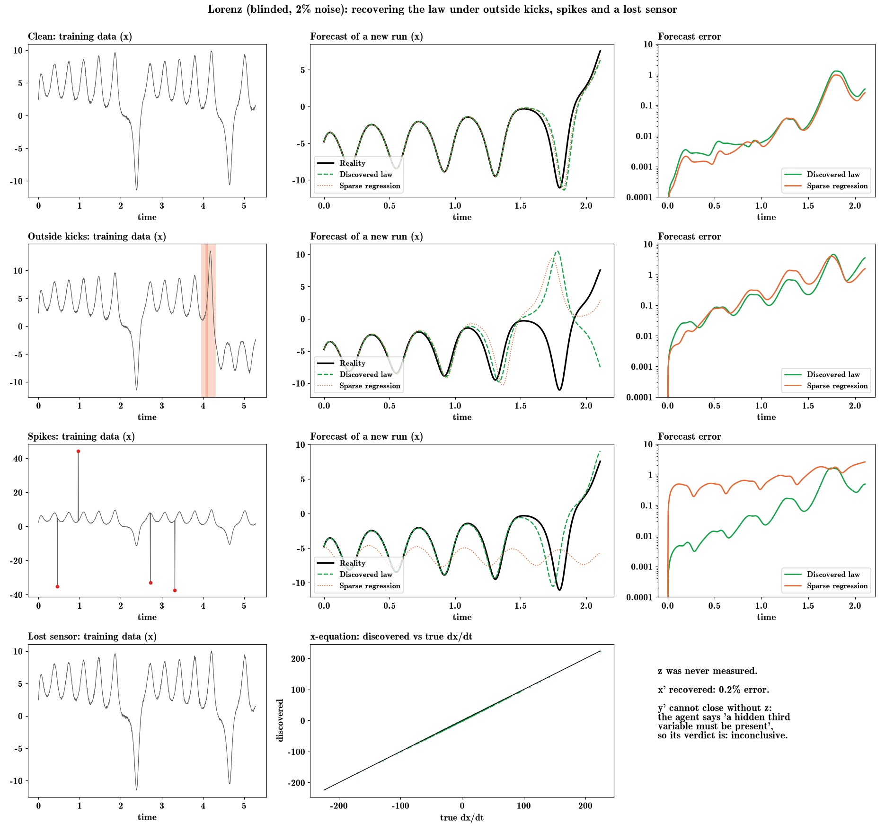
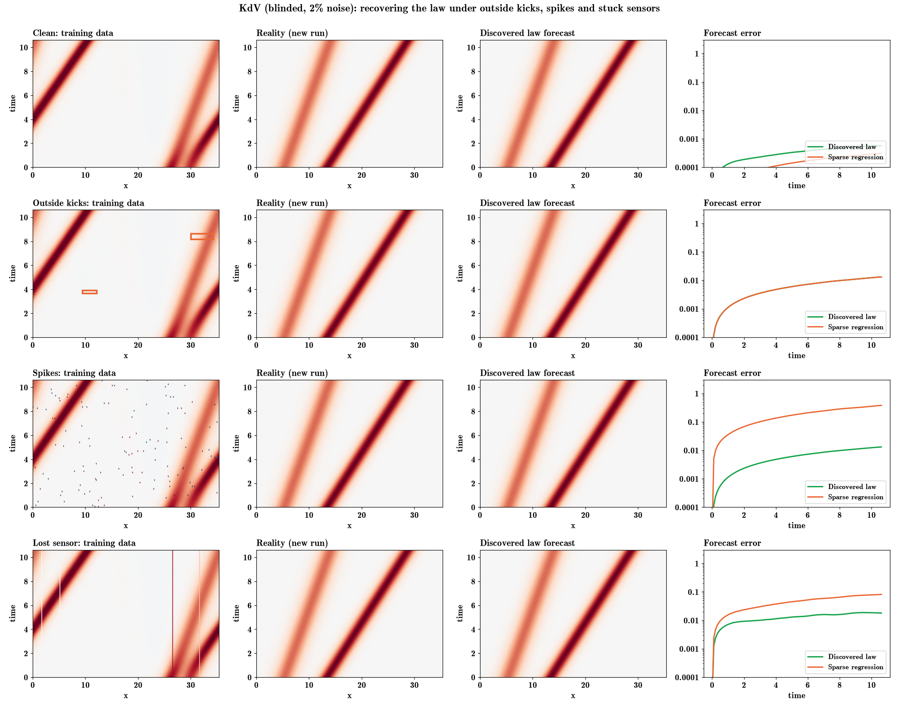

# Robustness: outside forcing, spikes and lost sensors

Can eqdisc recover a system's own law when the data are hit by unmodelled outside events or bad sensors?
Code: `eqdisc/robustness.py` (`make`, `run`). Data only, one agent session per case (`run_agent`, no context, no memory).

**Setup**
- Systems: Lorenz, a satellite orbit (Kepler + a moderate bulge), and KdV.
- Every system is **blinded**: variables, time and space are randomly rescaled, so no textbook coefficient
  (10, 28, 8/3 for Lorenz; −6, −1 for KdV) can be recalled.
- All conditions carry 2% measurement noise.
- Scoring: the found law's right-hand side is compared numerically with the true one on clean, unforced held-out
  states (relative RMS; form-independent).

| condition | what is done to the data |
|---|---|
| clean | nothing |
| forcing | 2–3 localised top-hat kicks per run: random times, and for KdV also a random patch of space |
| spikes | 0.5% of readings replaced by ±8σ glitches |
| sensor | Lorenz loses z; the orbit loses vz; KdV has 8 of 256 sensors stuck |

## Results (law error vs truth; agent / plain SINDy, no LLM)

| case | agent | SINDy | agent verdict |
|---|---|---|---|
| Lorenz clean | 0.1% | 0.1% | collect more data |
| Lorenz forcing | 0.4–0.8% | 0.5–1.0% | inconclusive |
| Lorenz spikes | **0.2–0.5%** | 11–37% | collect more data |
| Lorenz, z lost | x′ 0.2% | 0.2% | **inconclusive: "a hidden third variable must be present"** |
| KdV clean | 0.02% | 0.003% | confident |
| KdV forcing | 0.1% | 0.1% | collect more data |
| KdV spikes | **0.1%** | 5.4% | collect more data |
| KdV stuck sensors | 1.3% | 2.5% | confident |
| Orbit (all four) | 2–3% in range; **22% at 1.5× radius, ~60% at 2×** | 5–13%; 15–24% | collect more data (spikes: confident in predictions) |

Total cost $14.85.

## What this shows

- **Spikes are where the agent clearly beats plain regression.** Lorenz: 0.2–0.5% vs 11–37%. KdV: 0.1% vs 5.4%.
  Orbit: 2.5% vs 5–13%.
- **Localised forcing barely hurts either method** at this strength. Short kicks are a small part of the record,
  and least squares averages over them. Neither flags them explicitly.
- **Lost sensor, Lorenz: the ideal behaviour.** The agent recovered x′ exactly. It reasoned that crossing (x, y)
  trajectories are impossible for a 2-variable autonomous system, so a variable must be hidden, and it answered
  *inconclusive*.
- **Lost sensor, orbit: a miss.** It set z′ = 0 instead of flagging the missing velocity.
- **The orbit law is not recovered in any condition, including clean.** Both the agent and SINDy fit a polynomial
  that approximates 1/r² gravity inside the training radii and fails outside them. The corruptions are not the
  cause; this is the same failure as the Big Bulge Orbit demo.
- **Verdicts are cautious but not discriminating.** "Collect more data" appears on clean, correct Lorenz as well
  as on the wrong orbit law.

## Notes
- A first run used textbook parameters, and the agent typed Lorenz's 10, 28, 8/3 exactly (recall). It also
  had two pipeline bugs. That run is discarded; these results are from the blinded rerun.
